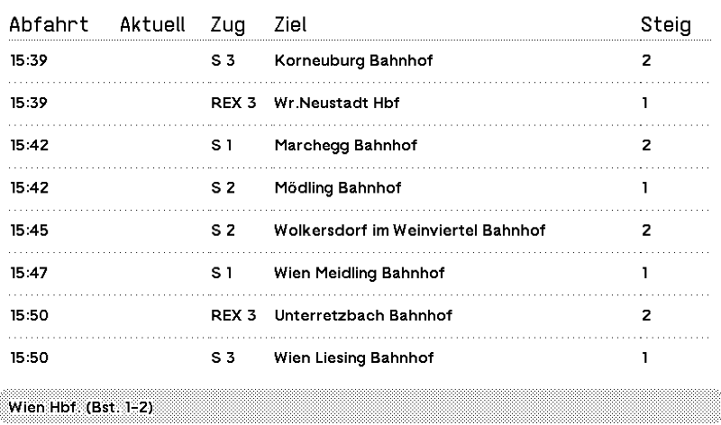
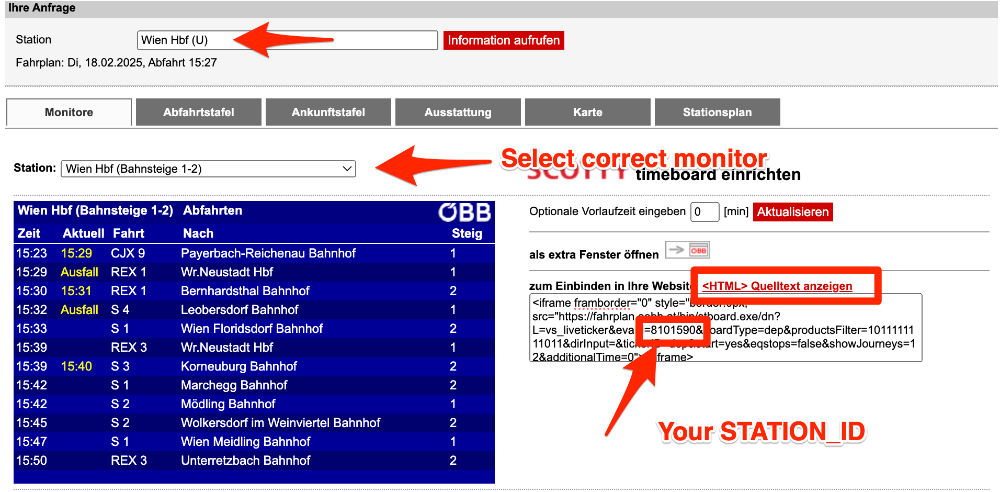

## TRMNL Train Monitor



## Description
This is a TRMNL plugin that monitors the status of trains.

Supported train companies:
- ÖBB (Austria)

### Environment Variables

| Variable                       | Description                               | Default                | Examples                                                                                           |
|--------------------------------|-------------------------------------------|------------------------|----------------------------------------------------------------------------------------------------|
| `TRMNL_PLUGIN_TYPE`            | Plugin Type                               | `private`              | `public`, `private`                                                                                |
| `TRMNL_DATA_STRATEGY`          | Data Strategy                             | `polling`              | `polling` , `webhook`                                                                              |
| `TRMNL_WEBHOOK_URL`            | Webhook URL                               | `null`                 | `https://usetrmnl.com/api/custom_plugins/{{$uuid}}`                                                |
| `OEBB_STATION_ID`              | ÖBB Station ID                            | `8101590`              | Default Vienna Main Station. Grab your station id from https://fahrplan.oebb.at/bin/stboard.exe/dn |
| `OEBB_STATION_NAME`            | ÖBB Station Name                          | `Wien Hbf. (Bst. 1-2)` |                                                                                                    |
| `OEBB_HIDDEN_TRACKS`           | Tracks that should be hidden from monitor | `null`                 | `1,2,3`                                                                                            |
| `OEBB_SCHEDULE_OFFSET_MINUTES` | Schedule offset in minutes                | `15`                   |                                                                                                    |
| `OEBB_REFRESH_EVERY_MINUTES`   | Refresh schedule data every minutes       | `15`                   |                                                                                                    |

## Getting started

1. Go to https://fahrplan.oebb.at/bin/stboard.exe/dn
2. Extract your station id as shown in the image.



3. Go to your TRMNL Dashboard and create a new Private Plugin.
4. Copy the Webhook URL.
5. Copy the Liquid Markup from section [Liquid Markup](#liquid-markup)

### Docker


Replace with `OEBB_STATION_ID` and `OEBB_STATION_NAME` with yours
```bash
docker run -p 8080:8080 --name trmnl-train-monitor \
-e PHP_OPCACHE_ENABLE=1 \
-e OEBB_STATION_ID=8101590 \
-e OEBB_STATION_NAME="Wien Hbf. (Bst. 1-2)" \
-e TRMNL_DATA_STRATEGY=webhook \
-e TRMNL_WEBHOOK_URL="https://usetrmnl.com/api/custom_plugins/${YOUR_UUID}" \
bnussbau/trmnl-train-monitor:latest 
```

### Docker Compose
* Copy into `docker-compose.yml` file
* Run `docker-compose up` in the same directory
```yaml
services:
    php:
        image: bnussbau/trmnl-train-monitor
        ports:
            - "8080:8080"
        environment:
            SSL_MODE: "off"
            AUTORUN_ENABLED: "true"
            PHP_OPCACHE_ENABLE: "1"
            OEBB_STATION_ID: "8101590"
            OEBB_STATION_NAME: "Wien Hbf. (Bst. 1-2)"
            TRMNL_DATA_STRATEGY: "webhook"
            TRMNL_WEBHOOK_URL: "https://usetrmnl.com/api/custom_plugins/${YOUR_UUID}"
```

## Build locally

### Clone repository

```bash
git clone git@github.com:bnussbau/trmnl-train-monitor.git
```

#### Docker Compose

Set the environment variables in the docker-compose.yml file.

```yaml
  php:
    environment:
      OEBB_STATION_ID: 8101590
      OEBB_STATION_NAME: Wien Hbf. (Bst. 1-2)
```

```bash
 docker compose up
```

#### Pure Docker
```bash
 docker build -t trmnl-train-monitor .  
```
```bash
docker run -p 8080:8080 --name trmnl-train-monitor trmnl-train-monitor:latest 
```

With Environment Variables (change to your station id and name)
```bash
docker run -p 8080:8080 --name trmnl-train-monitor -ePHP_OPCACHE_ENABLE=1 -e OEBB_STATION_ID=8101590 -e OEBB_STATION_NAME="Wien Hbf. (Bst. 1-2)" trmnl-train-monitor:latest 
```

## LAMP Stack

```bash
git clone git@github.com:bnussbau/trmnl-train-monitor.git
cp .env.example .env
composer install
php artisan serve
```

## Security
You may want to regenerate the application key.

### Docker Compose
```bash
docker-compose exec php php artisan key:generate && php artisan config:clear
```

### Pure Docker
```bash
docker exec -it trmnl-train-monitor php artisan key:generate && php artisan config:clear
```

# Liquid Markup
## Full

```liquid
<div class="layout">
  <table class="table">
    <thead>
      <tr>
        <th><span class="title">Plan</span></th>
        <th><span class="title">Aktuell</span></th>
        <th><span class="title">Zug</span></th>
        <th><span class="title">Ziel</span></th>
        <th><span class="title">Steig</span></th>
      </tr>
    </thead>
    <tbody>
      
      <tr>
        <td><span class="label">{{ journey.departure_time_planned }}</span></td>

        
        <td><span class="label label--inverted">{{ journey.status }}</span></td>
        
        <td><span class="label">{{ journey.departure_time_est }}</span></td>
        

        <td><span class="label">{{ journey.train_number }}</span></td>
        <td><span class="label">{{ journey.destination_station }}</span></td>
        <td><span class="label">{{ journey.track }}</span></td>

      </tr>
      

    </tbody>
  </table>
</div>
<div class="title_bar">
  
  <span class="title">Train Monitor</span>
  <span class="instance">updated at: {{ "now" | date: '%s' | plus: trmnl.user.utc_offset | date: "%Y-%m-%d %H:%M" }}</span>
</div>
```
